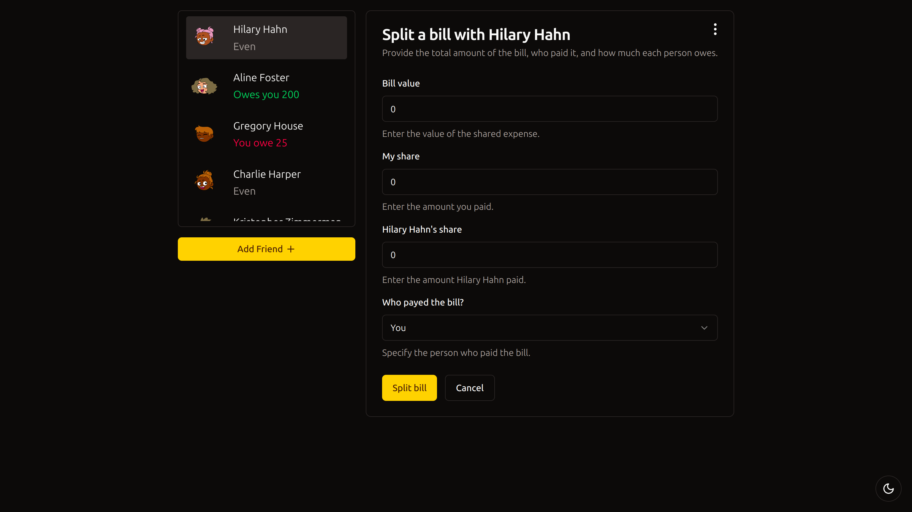
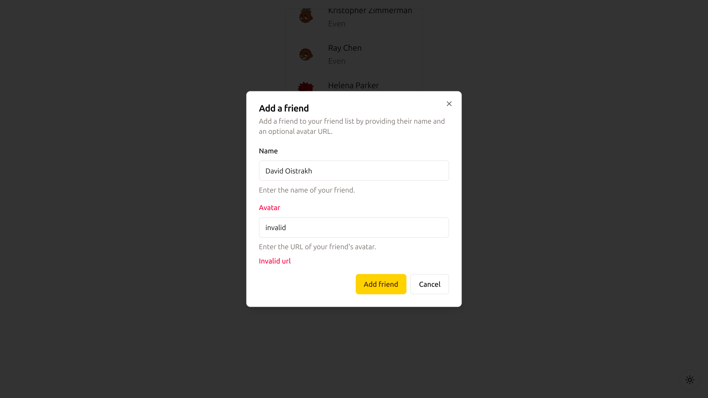
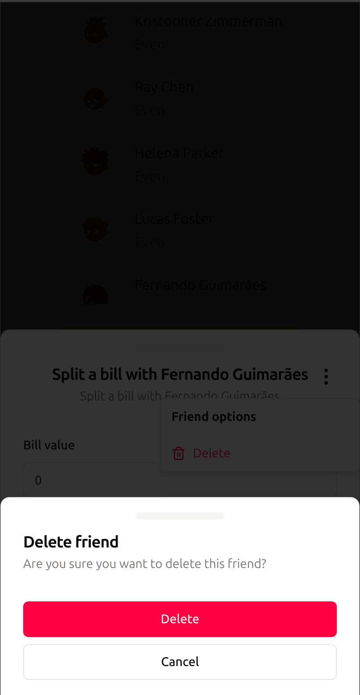

# Eat 'N Split

Split the bill for outings with your friends.

## About

This is one of the projects that I developed during my enrollment in the Jonas Schmedtmann's [React course](https://www.udemy.com/course/the-ultimate-react-course/). As custom features, I added:

- friends persistence using the Context API, custom hooks and browser local storage
- custom styling using [Tailwind CSS](https://tailwindcss.com/) and [Shadcn](https://ui.shadcn.com/);
- dark mode;
- forms validation using [React Hook Form](https://www.react-hook-form.com/);
- unit tests using [Vitest](https://vitest.dev/);
- end to end tests using [Cypress](https://www.cypress.io/).

## Dependencies

- Node.js `v20.9.0`
- pNpm `v9.1.2`

## How to run locally

After downloading the source code, run

    pnpm i
    pnpm dev

and to execute the test suites, run

    pnpm test
    pnpm e2e

## Snapshots

